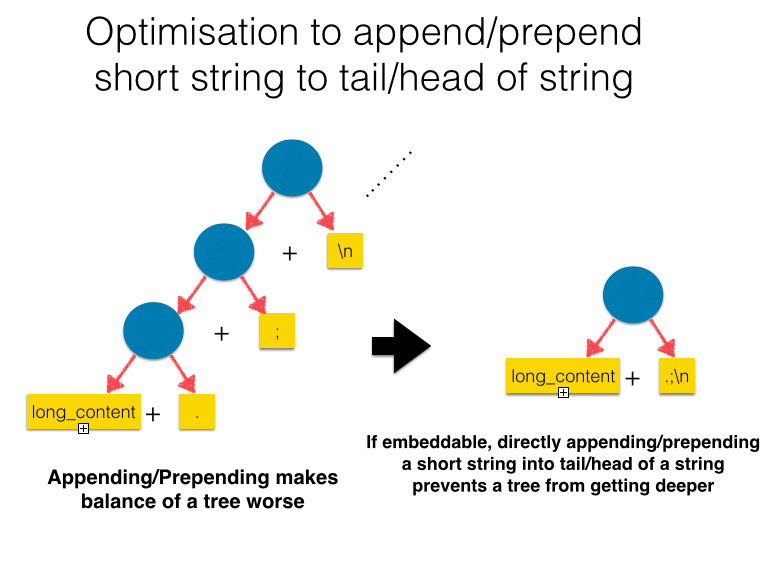
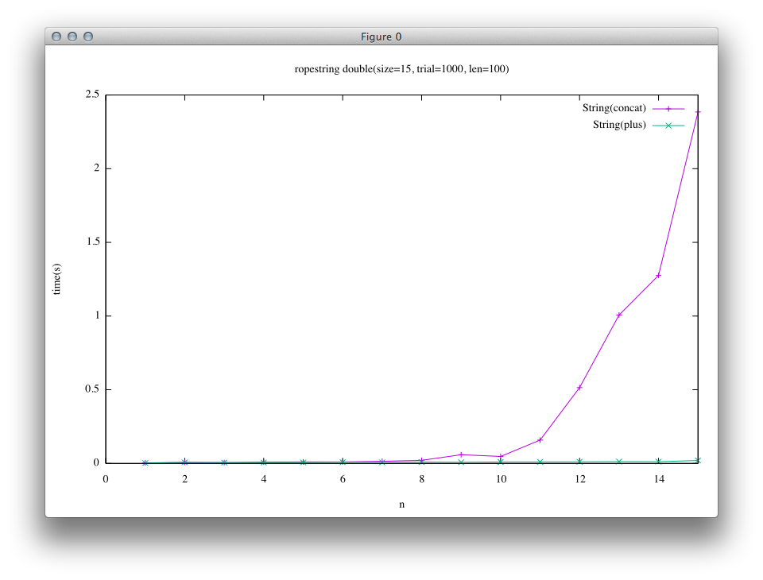
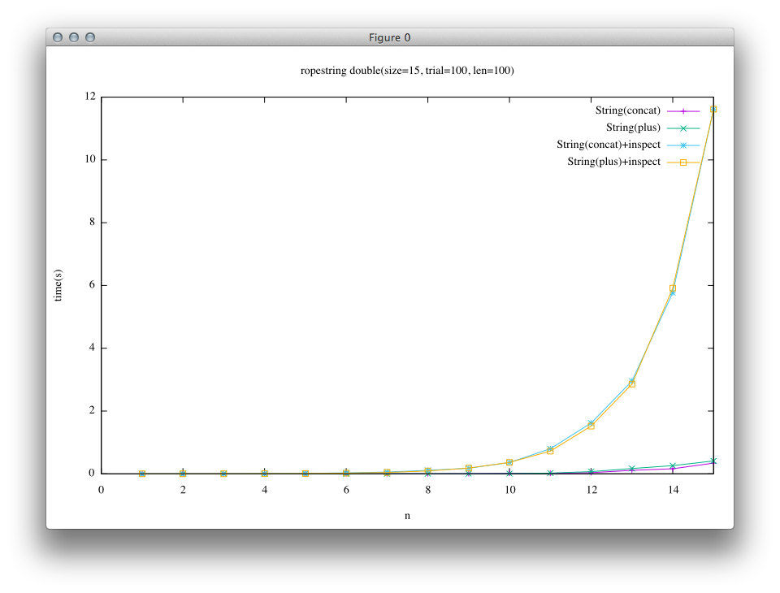
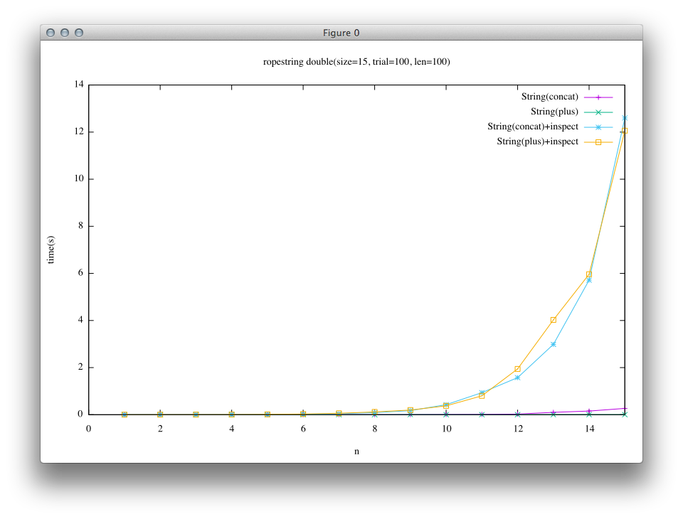

[日本語のページ]({{site.url}}{{site.baseurl}}/gsoc2016/japanese)

This page is the final report of my project in Google Summer of Code(GSoC)2016.

Proposal: [Automatic-selection mechanism for data structures in MRI](https://summerofcode.withgoogle.com/projects/#4576418910437376)

## What I did
* [Main(Rope)](#rope)
  * [Implement Ruby Rope C extension and experimental automatic selection class](#rope-extension)
    * Github: <https://github.com/spinute/CRope>
    * The whole repository is for this project
  * [Implement Rope into Ruby-Core and its automatic selection for String class](#rope-string)
    * <https://github.com/spinute/ruby/tree/implement_ropestring>
    * "implement-ropestring" branch is for this section of the project
* Other works
  * [Implement patches for Ruby core which enables concat and prepend methods in Array and String class to take multiple arguments](issue12333)
    * <https://bugs.ruby-lang.org/issues/12333> (3 patches are posted)
    * (update: Aug. 27) It was merged into trunk as [r56021](https://bugs.ruby-lang.org/projects/ruby-trunk/repository/revisions/56021/entry/ChangeLog)
  * [Merge a well-tuned hashtable into Ruby core (in progress)](#hashtable)
    * <https://github.com/spinute/ruby/tree/stbench/ext/stbench>
    * The whole repository is for this project


## Introduction

Note: In this report, I have written Ruby as MRI(Matz Ruby Interpreter), though there are several  other implementations such as JRuby(written in Java), Rubynius(in C++ and Ruby itself) ...etc.
There may be a lot of similarities between these implementations, however, it is not always the case.

<a name="rope"></a>

## Rope String

The main subject of this project is the implementation of Rope String, and dynamic and automated selection of data structure in Ruby string.

## Background
Classical implementation of string object in programming language is a sequential buffer such as array in C language, and Ruby has also adopted such a structure for string.

<a href="image/array_string.png">  </a>

Rope[https://en.wikipedia.org/wiki/Rope_(data_structure)](Wikipedia) is another data structure for string object, which expresses a given string in a tree structure.(Boehm, Hans-J, Atkinson, Russ, Plass, Michael; 1995)

In the most populer implementation, tree in Rope is binary.
The leaves are just array strings, and internal nodes present strings which enumerate, all the leaves of a subtree whose root is the internal node from left to right.

<a href="image/rope.png">  </a>

It is possible to convert Rope string into array string by following pseudo-equations.

* When node is a leaf: get-string(node) = string of node
* Else: get-string(node) = get-string(left child of node) + get-string(right child of node)

Rope surpasses array-expression in some basic operations especially in the meaning of time complexity, e.g. concatenation, deletion and substring.

My main challenge in Google Summer of Code 2016 (GSoC2016) is to introduce Rope into Ruby and enable users to enjoy its efficiency unconsciously.
In some languages which place their emphasis on efficiency, explicit data structures are required to write an efficient program.
However, that is not the approach Ruby has selected.
Ruby users tend to use a few data structures prepared in the language and they usually do not want to dive into the depth of selecting proper data structures for efficiency.
In this way, Ruby provides users with productivity and the joy of programming, and I have contributed to that virtue by offering automatic data structure selection mechanism which enables users to use efficient data structures transparently.

Being aware of the fact that important applications of Ruby are such as generation of HTML files in Web server and construction of documentations in RDoc, I selected tree-like string, Rope, as a target of this project. However, approaches in this project are also applicable to other data structures like List or GapBuffer, and to other class like Arary in Ruby.

Here, I will explain the merits of Rope in Ruby by taking a look at an existing problem in Ruby .

In Ruby, there are two methods used to concatenate strings.(There is also such method named concat, but it is just an alias of <<.)
The difference between the two methods is + is non-destructive concatenation while << destructs the receiver.
+ is known to hackers as slow who know internals of Ruby, and hence in the case where one can use <<, they use << instead of +.
However, depending on the result of this project, all the users can achieve the same efficiency of concatenation when using + compared to <<.

I will explain in a little more detail of these two methods below. (In fact, there is an optimization which embeds short strings into a string object, and those which is known as Copy on Write, however, I will ignore them for simplicity.)

<a href="image/plus_old.png">  </a>

When one calls a+b, + allocates enough wide buffer to accommodate both a and b, and copies the content of a and b into the buffer.

<a href="image/concat.png">  </a>

On the other hand, << copies the content of b into a's buffer. Only when a's buffer cannot accommodate b's content, a new and wider buffer is allocated and the contents of a and b are copied into the extended buffer.

It means that both a and b are copied and a new object is allocated on every call in +, and this only happens when a's buffer lacks space for b in <<.
Extensions of buffer are exponential; So, assuming that a task is repeatedly appending string of the same length, the quantity of copied strings is on the order of a square of the result string in + while at most 3x in <<.

I will explain how + works in Rope.

<a href="image/plus_rope.png">  </a>

In this project, Rope is implemented as an immutable data structure.
Rope can be considered as a data structure which enables lazy evaluation of the concatenations.
+ operation is done just by getting references of the two nodes, and it is performed efficiently in a constant time complexity.
Only after the content of a concatenated string is required, one has to traverse all the leaves in the Rope, and create the array string.
In this process, the required length of the output array string is known before traversing, and hence Rope can avoid sequential copies needed in + and buffer extension needed in <<.

Rope can also gain and delete a substring more efficiently as well compared to array string in the meaning of time complexity.

There have been libraries which implemented Rope and have offered it when being required explicitly, however these are written in Ruby.
As part of the result of this project, I implemented Rope extension for Ruby in C, and I also implemented automated-selection mechanism for string representation which enables users to enjoy efficiency of both data structures without awareness or fatigue.

<a name='rope-extension'></a>

## Ruby Rope C extension and experimental automatic selection class
Firstly, I implemented Rope as an extension written in C.
The purpose of this implementation is prototyping; I was novice to Ruby's internal before this project, so I divided complexities in the implementation of Rope string and the modification of the behavior of Ruby.

I used CData type which wrap C structures as Ruby object. The members of Rope structure are pointers for right/left child and a length of the subtree whose root is the object.
This implementation offers functions seen in <https://github.com/spinute/CRope/blob/master/ext/rope/rope.h>.
As basic string operations, concatenation, substring, indexing, deletion, and iteration over string are supported. RopeToString is prepared in order to obtain array string from rope string.

I implemented Rope by **NOT** using Garbage Collector in Ruby core but by using reference count which I prepared by myself for simplicity, as this implementation is prototyping.
However, reference counting visits all the nodes in a tree when calling concat or delete methods, and hence these methods become slower than that of ideal time complexity of Rope data structure.
The purpose of prototyping is to ensure the possibility of the project, and I succeeded to evaluate the performance of the ideal implementation of Rope by turning off the reference counting, meaning this extension includes memory leaks for accomplishing ideal performance, and it is the reason why I did not provide its extension as RubyGem (Package Management System of Ruby Language).
I decided to leave this problem because I tried implementing Rope string into Ruby interpreter itself and the problem automatically vanished by using Garbage Collector in Ruby.

<a name='rope-string'></a>

## Implementation of Rope into Ruby core
After the prototyping stated above, I implemented Rope into String class of Ruby interpreter.
I used a flag of a Ruby object to express that the object is Rope.(Used FL_USER_0 as STR_IS_ROPE)

When String#+ is called and the length of the output is larger than the maximum embeddable length of string object in Ruby, a state of the output String object is set to Rope.
At the time, if some operands of + are mutable, new objects which have the same content of the mutable operand but is immutable will be created, and the created rope will have the references of the immutable objects as left and right child.
In other words, though Ruby string object is generally not immutable, Rope is an immutable object and leaves are made to be immutable.
After that, when array string is needed, Rope string is converted into array string.

A construction of Rope by + can be considered as lazy processing of concatenation.
As mentioned before, << and present implementation of + process a concatenation at every operation.
On the other hand, + over Rope will concatenate array strings only after the concatenated string is required, and hence + of Rope runs quite fast without depending on the length of operands.

Adding to that, I optimized Rope implementation as below.

1. Embed short append/prepend into the tail/head of Rope
2. Construct Rope by methods other than String#+
3. Implementation of string methods which directly work on Rope strings

#### Embed short append/prepend into tail/head of Rope
In real applications which heavily use strings, it often appear to append short strings repeatedly to construct large strings.
For example, constructing a document from the beginning or concatenating lines and appending a new line characters follows the pattern; It is what WebServers or Documentation tools do, and these are some of the most important applications of Ruby language.

In these construction patterns, naive implementation of + on Rope generates an unbalanced tree, and the tree cannot perform efficiently.
Ruby has already had optimization to embed short string into an object itself(structure in C language) as a sequence of bytes.
I implemented Rope to embed the short string into its tail/head not to add a new object into the Rope but to prevent the tree from getting deeper when appending/prepending an embeddable string to tail/head of a Rope string, depicted in the figure below.

<a href="image/embed_optimization.png">  </a>

#### Construct Rope by methods other than String#+
It is possible to create Rope string by other methods than String#+ which produce a new string by combining or repeating operands.
For now, I only implemented String#\* which repeats a provided string as Rope string in order to achieve lazy array string generation.

I am not sure how useful it may be in real applications, but in scenarios where one generates large string by such a method like + or * and uses some part of the string or some properties which does not always need a whole array string, this optimization would be effective because a generation of a large string will not be performed. (e.g. Thinking str * 1000000, the large string will be created when * being called in present implementation, while the optimized Rope will not create the large array string until required though it can still offer us some properties of the string such as the length or it is also possible to create substring of the string.)

<a href="image/multi_rope.png">  </a>

#### Implementation of string methods which directly work on Rope strings

As the evaluations below implies, constructing a large string in Rope is quite fast, however, to convert the Rope into array string consumes much time.
In cases where a whole concatenated string is not used eventually, if some methods can perform over Rope directly, it saves us from converting the unused part of the rope into array string.

To enable this optimization, it is necessary to modify methods in String class to apply operations over rope in order to get the result equivalent to that over array string which is now implemented.
For now, I only implemented substring method for this optimization, though other methods such as indexing, iteration over Rope, capitalizing ...etc. can also be implemented in the same way.

<a href="image/substr_rope.png">  </a>


### Evaluation

Parameters of the experiments are embedded into a title of graphs.

* size: the scale of experiment
* len: the length of initial concatenated string
* trial: the number of measurement repeated

In each result, left column is for trunk(e5c6454efa01aaeddf4bc59a5f32d5f1b872d5ec), while right is for this project.

#### Case: Double a string
A program below is for this benchmark.
In this benchmark, a string is repeatedly doubled, and ropes produced are perfectly balanced.

```ruby
# String(concat)
e = String.new "a"*len
n.times { e << e }

# String(plus)
e = String.new "a"*len
n.times { e += e }
```

<a href="image/double_concat_trunk_only.png"></a>
<a href="image/double_concat_rope_only.png"></a>

It can be seen that the result of Rope(a green line in the right graph) runs extremely fast compared to other results.
It reflects the fact that concatenation on Rope is done just by getting references of operands, while in trunk concatenation operations create actual array string when called.

The next benchmark includes an additional process which requires array string to the previous benchmark.

```ruby
# String(concat)+inspect
e = String.new "a"*len
n.times { e << e }
e.inspect

# String(plus)+inspect
e = String.new "a"*len
n.times { e += e }
e.inspect
```

<a href="image/double_concat_trunk.png"></a>
<a href="image/double_concat_rope.png"></a>

It can be seen from the results, the effectiveness of concatenation on Rope string is hidden behind a requirement of the array string in this experiment.

#### Case: append a constant string
A program below is for this benchmark.
In this benchmark, a string is repeatedly appended to another string, and ropes produced deeply lean to the left.

```ruby
# String(concat)
s = String.new "a"*len
n.times { e << s }
e.inspect  # in case of "+inspect"

# String(plus)
s = String.new "a"*len
n.times { e += s }
e.inspecta # in case of "+inspect"
```

First result is for the case where appended string is short(len = 1).
In this case, short string is an embedded string.

<a href="image/append_concat_trunk_short.png"></a>
<a href="image/append_concat_rope_short.png"></a>

Second result is for the case where appended string is long(len = 30).(The number of trials are set to a small number)
In this case, short string is not an embedded string.

<a href="image/append_concat_trunk_long.png"></a>
<a href="image/append_concat_rope_long.png"></a>

From the results, it can be seen that in the left column(the result of trunk) the time lapse of + is quite large compared to that of <<.
This leads to the mystic insight of Ruby users who say "+ is slow, use <<".

On the other hand, in the right column(after implementation of Rope), the result is different.
In short string case, the difference between << and + becomes smaller.
And in long string case, << and + are almost the same.
In trunk, both the green line and yellow line(for +) are close to each other, and purple and blue lines(for <<) are also close to each other. On the other hand, in Rope result blue line and yellow line(+ and << with inspect) looks similar, and green and purple lines also look similar, meaning that Rope implementation enables + to achieve similar performance as <<.

### Conclusion and remained problems
I implemented C extension of Rope for Ruby language as a prototyping, also implementing Rope into Ruby String class and a dynamic implementation selection mechanism.
I confirmed the efficiency of concatenation of Rope string, and it solves the recognized performance problem of +.

According to the evaluation, concatenation itself is done rapidly but when array expression of output string is needed, a cost of conversion from Rope to array prevent + of Rope from surpassing <<.
Second and third optimization stated above is partially done in this project(I could only implement a few numbers of method), however, there may be other possible optimized methods, and by the optimization it would become possible to construct diverse large strings as Rope and to process or filter the string as Rope, and gaining the smaller output string compared to input string or intermediate strings. In this scenario, Rope allows us to not create large array string and it may follow large improvement in both performance and memory.
For this ambition, it is necessary to survey the frequent sequences for large string processing in real applications. If these methods are possible to be implemented effectively in Rope(or other data structures) there are possible optimizations by applying the approach taken in this project.

One of the problem remaining is that test cases (by running make test-all) below sometimes fail.  (at [implement_rope branch: 250deede](https://github.com/spinute/ruby/commit/250deedef4bf253238f53559db26cd9c4793b6ec), on OSX 10.9.5)

* TestSocket_UDPSocket#test_send_no_memory_leak(test/socket/test_udp.rb:94)
* TestProcess#test_deadlock_by_signal_at_forking(test/test_process.rb:2103)
* test/rss
* test/rexml

<a name="issue12333"></a>

## Post patches for issue#12333
During my Community Bounding Period, I read two books ["Ruby Hacking Guide"](https://ruby-hacking-guide.github.io/) and ["Ruby Under a Microscope"](https://www.nostarch.com/rum), and official online resources such as [Ruby C API reference](http://docs.ruby-lang.org/en/trunk/extension_rdoc.html), [Ruby Wiki](https://bugs.ruby-lang.org/projects/ruby/wiki/).

After that I selected an issue posted in [Bug Tracker System of Ruby](https://bugs.ruby-lang.org/issues) at the perspective of having relations with the topic in this project without going too complicated.
I selected this issue [\"String#concat, Array#concat, String#prepend to take multiple arguments\"](https://bugs.ruby-lang.org/issues/12333) as my first activity diving into Ruby internal, and implemented a feature that enables methods such as concat and prepend in Array and String to have multiple arguments.

The point of discussion in the link above is how a string behaves in the case where a string sticks the same multiple strings of itself to itself.
An example is the code below.

```ruby
str = "a"
str.concat(str, str)
```

After running this program, should str become "aaa" or "aaaa"?
It may be natural to use "aaa" by reading the code as "concat str twice into str", however, it is also reasonable to keep the behavior equal to two consecutive calls of `str.concat(str)`.

I implemented patches for both behaviors, and reported this implementation in a developer's meeting in July receiving some feedbacks about implementation from Ruby committers, and gaining a positive response for this feature from Matz.

<a name='hashtable'></a>

## Benchmark of another implementations of Ruby's internal hashtable 

<https://github.com/spinute/ruby/tree/stbench/ext/stbench>

In the last week of this project, I tried to implement benchmarks for <https://bugs.ruby-lang.org/issues/12142>.

This issue is to improve hashtable used for both Hash class in Ruby and other internal usages.
There are two new implementations posted by Vladimir Makarov and Yura Sokolov, the former uses open-addressing while the latter not.
Both implementations seem to get sophisticated while discussion over several months, working better than present implementations and to be competitive with each other.
These works seems valuable to be merged, though they lack a little objective evaluation; So I tried to implement more benchmarks for evaluation to promote merge.

For now, there are several benchmarks attached to Ruby which is written in Ruby and call Hash operations repeatedly, and these results have already been posted in the thread.
In addition to these results, the performances of basic operations in C level not Ruby level should be measured for more precise evaluation, and hence I decided to implement such benchmarks.

I implemented STBench extension which includes partials of scenarios written in C, and STBench can select a scenario by following parameters. As a note, I implemented it as an extension to build the code easily while the implementations of hashtable(st.c) uses Ruby internal codes.

The implementation of STBench class is in <https://github.com/spinute/ruby/blob/stbench/ext/stbench/stbench.c>.
All the benchmark follows the similar process, ~\_setup -> ~\_run -> ~\_cleanup, and it is assumed to call in order.(Usage is written below.)

Parameters(for now)

* Scale of benchmark
* Initial size of hashtable
* type of keys := integer, (long or short) string
* selection of keys := same, different, random
* operation := insert, delete, search, init/fini

Results are reported in time lapse, and Max RSS before&after benchmarking.

Example of benchmark script is below.

```ruby
# Set benchmark parameter
keytype='num'; ht_init_size=0, scale=10; patter='rand'

# Fork a process to measure memory usage separately
pid = Process.fork do
  bench = STBench.new
  bench.search_setup keytype, ht_init_size, scale, pattern
  puts Benchmark.measure { bench.search_run }
  bench.search_cleanup
end
Process.waitpid pid
```

The result is as below.

<pre>
Insert bench: keytype=num,    pattern=rand,   scale=10,    ht_init_size=0, keylen=5
  0.890000   0.040000   0.930000 (  0.933727)
  before:    4730880, after:   39747584, diff  35016704
</pre>

The first line reports parameters of the benchmark.

* Keys are randomly inserted
* 10 * 100000 times (100000 is a base of scale)
* Initial size of hashtable is not specified

Second line reports time lapse, which is measured "benchmark" library in Ruby.

The third line reports Max RSS(after initialization, after benchmarking, and the difference), measured by getrusage(2).

A script to run benchmarks for a set of parameters is in <https://github.com/spinute/ruby/blob/stbench/ext/stbench/bench.rb>.

Remaining tasks are to implement another benchmark for foreanch, and to measure performances of the two new implementations and the old implementation, and post results to developers, adding other scenarios or refining benchmarks.

## Acknowledgement
I would like to express my best thanks to Mr. Koichi Sasada for mentoring me throughout the whole my project. His great insight into Ruby helps me and provides me with interesting discussions other than the range I actually have worked on.
I would also like to thank those who manage Google Summer of Code for offering students including me with the precious opportunity during this summer.

