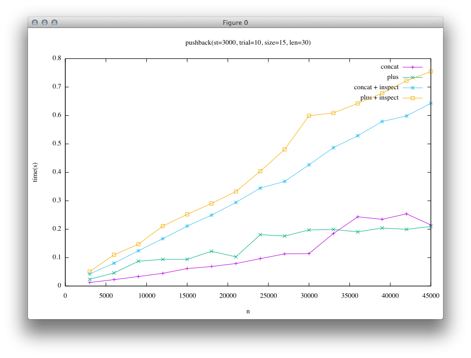

[日本語のページ]({{site.url}}{{site.baseurl}}/gsoc2016/japanese)

This page is a report of my project in Google Summer of Code(GSoC)2016.
[Automatic-selection mechanism for data structures in MRI](https://summerofcode.withgoogle.com/projects/#4576418910437376)

## Acknowledgement
I would like to express my best thanks to Mr. Koichi Sasada for mentoring whole my project. His great insight into Ruby helps me much and provides me much more interesting discussions beyond the range I actually have worked on.
I also would like to thank those who manage Google Summer of Code for offering students including me with the precious opportunity in this summer.

## What I did
* [Rope](#rope)
  * [Implement Ruby Rope C extension and experimental automatic selection class](#rope-extension)
    * Github: <https://github.com/spinute/CRope>
    * Whole repository is for this project
  * [Implement Rope into Ruby-Core and its automatic selection for String class](#rope-string)
    * <https://github.com/spinute/ruby/tree/implement_ropestring>
    * "implement-ropestring" branch is for this section of the project
* Other works
  * [Implement patches for Ruby core which enables concat and prepend methods in Array and String class to take multiple arguments](issue12333)
    * <https://bugs.ruby-lang.org/issues/12333> (3 patches are posted)
  * [Merge a well-tuned hashtable into Ruby core (in progress)](#hashtable)
    * <https://github.com/spinute/ruby/tree/stbench/ext/stbench>
    * Whole repository is for this project


## Introduction

Note: In this report, I have written Ruby as MRI(Matz Ruby Interpreter), though there are several  other implementations such as JRuby(written in Java), Rubynius(in C++ and Ruby itself) ...etc.
There may be a lot of similarities through these implementations, however, it is not always the case.

<a name="rope"></a>

## Rope String

Here is the central of this project on the implementation Rope, and dynamic and automated selection of data structure in Ruby string.

## Background
Classical implementation of string object in programming language is a sequential buffer such as array in C language, and Ruby has also adopted such a structure for string.

<a href="image/array_string.png">  </a>

Rope[https://en.wikipedia.org/wiki/Rope_(data_structure)](Wikipedia) is another data structure for string object, which expresses a given string in a tree structure.(Boehm, Hans-J, Atkinson, Russ, Plass, Michael; 1995)

In the most populer implementation, tree in Rope is binary, and the leaves are just array strings, and internal nodes present strings which enumerate from left to right all the leaves of a subtree whose root is the internal node.

<a href="image/rope.png">  </a>

It is possible to convert Rope string into array string by following pseudo-equations.

* When node is a leaf: get-string(node) = string of node
* Else: get-string(node) = get-string(left child of node) + get-string(right child of node)

Rope surpasses array-expression in some basic operations especially in the meaning of time complexity, e.g. concatenation, deletion and substring.

My main challenge in Google Summer of Code 2016 (GSoC2016) is to introduce Rope into Ruby and enable users to enjoy its efficiency unconsciously.
In some languages which place their emphasis on efficiency, explicit data structures are required to write an efficient program.
However, that is not the approach Ruby has selected.
Ruby users tend to use a few data structures prepared in the language and they usually do not want to dive into the depth of selecting proper data structures for efficiency.
In this way, Ruby provides users with productivity and the joy of programming, and I have contributed to that virtue by offering automatic data structure selection mechanism which enables users to use efficient data structures transparently.

Being aware of the fact that important applications of Ruby are such as generation HTML files in Web server and construction of documentations in RDoc, I selected tree-like string, Rope, as a target of this project. However, approaches in this project are also applicable to other data structures like List or GapBuffer, and to other class like Arary in Ruby.

Here, I will explain merits of Rope in Ruby by taking a look at an existing problem in Ruby .

In Ruby, there are two methods used to concatenate strings.(There is also such method named concat, but it is just an alias of <<.)
The difference between the two methods is + is non-destructive concatenation while << destructs receiver.
+ is known to hackers who know internals of Ruby as slow, and hence in the case where one can use <<, they use << instead of +.
However, depending on the result of this project, all the users can achieve the same efficiency of concatenation when using + compared to <<.

I will explain in a little more details of these two methods below. (In fact, there is an optimizations which embeds short strings into a string object, and which is known as Copy on Write, however, I will ignore them for simplicity.)

<a href="image/plus_old.png">  </a>

When one calls a+b, + allocates enough wide buffer to accommodate both a and b, and copies the content of a and b.

<a href="image/concat.png">  </a>

On the other hand, << copies the content of b into a's buffer. Only when a's buffer cannot accommodate b's content, a new and wider buffer is allocated and then the contents of a and b are copied into extended buffer.

It means that at both a and b are copied and a new object is allocated on every call in + and while they happens only when a's buffer lacks space for b.
Extension of buffer is exponential; So, assuming that a task is repeatedly appending string of the same length, the quantity of copied strings is on the order of a square of the rusult string in + while at most 3x in <<.

I will explain how + works in Rope.

<a href="image/plus_rope.png">  </a>

In this project, Rope is implemented as an immutable data structure.
Rope can be considered as a data structure which enables lazy evaluation of the concatenations.
+ operation is done just by getting references of the two nodes, and it is performed efficiently in a constant time complexity.
Only after the content of a concatenated string is required, one has to traverse all the leave in the Rope, and create the array string.
In this process, the required length of the output array string is known before traversing, and hence Rope can avoid sequential copies needed in + and buffer extension needed in <<.

Rope can also get and delete substring more efficiently as well compared to array string in the meaning of time complexity.

There have been the libraries which implemented Rope and have offered it when required explicitly, however these are written in Ruby.
As part of the result of this project, I implemented Rope extension for Ruby in C, and I also implemented automated-selection mechanism for string representation which enables users to enjoy efficiency of both data structures without awareness or fatigue.

<a name='rope-extension'></a>

## Ruby Rope C extension and experimental automatic selection class
Firstly, I implemented Rope as an extension written in C.
The purpose of this implementation is prototyping; I was novice to Ruby's internal before the project, so I divided complexities in the implementation of Rope string and the modification of the behavior of Ruby.

I used CData type which wrap C structure as Ruby object. The members of Rope structure are pointers for right/left child and a length of the subtree whose root is the object.
This implementation offers functions seen in <https://github.com/spinute/CRope/blob/master/ext/rope/rope.h>.
As basic string operations, concatenation, substring, indexing, deletion, and iteration over string are supported. RopeToString is prepared in order to obtain array string from rope string.

I implemented Rope by **NOT** using Garbage Collector in Ruby core but by using reference count which I prepared by myself for simplicity, as this implementation is prototyping.
However, reference counting visits all the nodes in a tree when calling concat or delete methods, and hence these methods become slower than that of ideal time complexity of Rope data structure.
The purpose of prototyping is to ensure the possibility of the project, and I succeeded to evaluate the performance of the ideal implementation of Rope by turning off the reference counting, meaning this extension includes memory leaks for accomplishing ideal performance, and it is the reason why I did not provide its extension as RubyGem (Package Management System for Ruby Language).
I decided to leave this problem because I tried implementing Rope string into Ruby interpreter itself and the problem automatically vanished by using Garbage Collector in Ruby.

<a name='rope-string'></a>

## Implementation of Rope into Ruby core
TODO: merge japanese.md

At last, I implemented Rope into String class of Ruby interpreter.
When String#concat is called, a state of String object changes into Rope.
On the other hand, when string as an array is needed, Rope string is converted into array string automatically.

As a note, in my proposal, I thought of the problem in wider scope.
The efficiency of the operation is determined by the state of the data, and its expression as a data structure.
For example, to hold sequence of characters, when Array is used then random accessing by index is performed efficiently, on the other hand, when List is used then insertion or deletion of internal characters is efficient, while its not efficient in Array case.
Ruby has offered Array as universal data structure, and not offer other normal data structures such as List, Queue, Stack.
This design is easy to use and provides users with concentration on their high level tasks, however, sometimes it is proved to be inefficient.
The goal of this project is to develop a mechanism which uses multiple data structures internally and switches them dynamically, and, on the other hand, which looks just a normal object for users.

During a life of an object

Ropeの利点を活かすために以下のような最適化を実装しました。

1. 先頭あるいは末尾に埋め込み可能な文字列を追加する際にて新たにノードを追加しない
2. String#+以外のメソッドによるRopeの構築
3. Ropeに対して直接実行可能なメソッドの実装

#### 先頭あるいは末尾に埋め込み可能な文字列を追加する際には埋め込みを行う
実際のアプリケーションの中で多くある文字列の結合の仕方として、末尾に短い文字列を結合することを繰り返す、というものです。
文書を先頭から順に構築して行ったり、行を結合して改行記号を結合してという処理を考えるとこれは多くの実アプリケーションで現れています。

このようなとき、Ropeの+演算で木を構築すると、左に非常に傾いた木ができてしまい、処理の効率がよくありません。
ここで、Rubyの配列表現の文字列では短い文字列はバイト列としてオブジェクトに対応するCの構造体に直接埋め込む、という最適化があります。
文字列の先頭あるいは末尾に対して、現在先頭の文字あるいは末尾の文字を含んでいる葉に足しいて埋め込み可能な文字列を追加する際には下の図のような埋め込みによる結合を行うことで木が深くなることを抑制する最適化を実装しました。

<a href="image/embed_optimization.png">  </a>

#### String#+以外のメソッドによるRopeの構築
+以外ではString#\* においてもRopeのまま処理を行うことで繰り返しを遅延する実装をしています。
引数文字列を組み合わせたり繰り返したりして新たな文字列を生成する他のメソッド(例えばString#\* )においても同様の方法で遅延が可能なはずです。
あまり役に立つ実例が見つかっていないのですが、大きな文字列を作るが、その一部分しか利用しない場合や、結果文字列の性質のみを知りたい場合、実際の文字列を生成する必要がない利点が生きてくるかもしれません。(例. str * 1000000などをすると、既存の実装ではこの処理の実行時にstrの1000000倍の長さを持つ文字配列が作成されますが、Ropeでは結果の文字列を実際に配列として使うまで、配列は作らず、また例えば文字列長などの性質や部分文字列は実際に文字列全体を作成せずに得る事ができます。)

<a href="image/multi_rope.png">  </a>

#### Ropeに対して直接実行可能なメソッドの実装

下に述べる性能評価を見るとわかるように、大きな文字列に対応するRopeは、結合による構築は非常に高速ながら、配列形式の文字列への変換に大きなコストがかかっていることがわかります。
最終的に文字列の全体が必要ない場合には、Ropeに対してそのまま処理を施すことができるメソッド。

このような最適化が可能なメソッドの例としては、部分文字列の取得や文字毎の繰り返し処理などがあります。
これを行うためには、Stringクラスのメソッドに対して、オブジェクトがRopeであった際に配列文字列の場合と等価な結果を計算する処理を実装する必要があります。

今回は部分文字列の取得のみ実装を行いました。

<a href="image/substr_rope.png">  </a>


### 性能評価

実験のパラメータはグラフのタイトルに埋め込んであります。

* size: 実験のスケール
* len: 結合する文字列の長さ
* trial: 試行回数

いずれも、左の列がtrunk(e5c6454efa01aaeddf4bc59a5f32d5f1b872d5ec)での計測結果、右の列がこのプロジェクトの計測結果です。

#### 文字列を倍々にする
以下の様なプログラムでベンチマークを取りました。
このベンチマークではある文字列を左右の子とする新たな文字列を生成するので、Ropeの木が完全にバランスします。

```ruby
# String(concat)
e = String.new "a"*len
n.times { e << e }

# String(plus)
e = String.new "a"*len
n.times { e += e }
```

<a href="image/double_concat_trunk_only.png"></a>
<a href="image/double_concat_rope_only.png"></a>

Ropeの結果(右のグラフの緑色の結果)を比較すると他の結果と比べて極めて小さな時間で実行できているのがわかると思います。
これはRopeの結合処理では文字列の参照を取得するだけであるのに対して、trunkの実装では結合字に結果文字列を実際に作成しているためです。

続いては、上の処理に加えて、結合後の文字列に対して配列文字列を必要とする処理を実行するベンチマークです。

```ruby
# String(concat)+inspect
e = String.new "a"*len
n.times { e << e }
e.inspect

# String(plus)+inspect
e = String.new "a"*len
n.times { e += e }
e.inspect
```

<a href="image/double_concat_trunk.png"></a>
<a href="image/double_concat_rope.png"></a>

この結果を見てみると、先の実験ではRopeの結合処理が高速であった点が、この実験結果では隠れていることがわかるかと思います。

#### 一定の長さの文字列を末尾に結合していく
このベンチマークでは、文字列を末尾に結合していきます。
この場合、Ropeの木は左に傾いた木になります。

```ruby
# String(concat)
s = String.new "a"*len
n.times { e << s }
e.inspect  # +inspectの場合

# String(plus)
s = String.new "a"*len
n.times { e += s }
e.inspecta # +inspectの場合
```

1つ目の結果は短い文字列(len=1)を末尾に追記することを繰り返した結果です。

<a href="image/append_concat_trunk_short.png"></a>
<a href="image/append_concat_rope_short.png"></a>

2つ目の結果は長い文字列(len=30)を末尾に追記することを繰り返した結果です。(実行回数trialを少なめにしています)

<a href="image/append_concat_trunk_long.png"></a>
<a href="image/append_concat_rope_long.png"></a>

結果を見ると、左の列(trunkでの比較)では<<に対して+の実行時間が非常に大きいことがわかります。
このため、現在のRubyユーザーの知見として、"+は遅いので<<を使う"ということになっています。

一方で、右の列(Rope実装後の比較)では、短い文字列の場合ではtrunkと比べると<<と+の差が小さくなっていることがわかります。
大きい文字列の場合には、trunkでは緑と黄色の列(+)と紫と青の列(<<)で結果が大きく離れていたのに対して、Ropeの結果では青と黄色(+と<<にinspectを加えたもの)、緑と紫(+と<<)で似た結果になっていることがわかり、Ropeの実装によって+においても<<に近い性能が得られるようになっていることがわかります。

### まとめと課題
Rope文字列の実装を拡張ライブラリとして実装した後、Ruby処理系のStringクラスに実装しました。
結合処理は定数時間で実行できることを確認し、既存の+メソッドによる文字列の結合の性能を改善することを確認しました。

実験結果をみると、結合処理自体はRopeで行うのが圧倒的に早いにもかかわらず、配列表現の結果文字列全体を最終的に必要とするような用途では、Ropeと配列表現の文字列の変換コストによって<<とRope上の+の差がない、という結果になっています。
2,3つめの最適化について、今回は限られた数のメソッドしか実装することができていませんが、実装したメソッドの他にも最適化が可能なメソッドがあり、Ropeとして大きな文字列を作り、Ropeのままで文字列を処理してから比較的小さな結果文字列を得られるような実用的なシナリオがあれば、Ropeを導入しなければ達成できない高速化が達成できるのではないかと考えています。
実際のアプリケーションの中で、大きなRope文字列に対して適用されることの多いメソッド調査し、その効率的なRope実装が可能であれば行うことは最適化の可能性としてやり残されています。

残された問題点としてテストケース(make test-all)のうち、以下のものがまだ安定して通過していません。([implement_ropeブランチ: 250deede](https://github.com/spinute/ruby/commit/250deedef4bf253238f53559db26cd9c4793b6ec), OSX 10.9.5にて実行)

* TestSocket_UDPSocket#test_send_no_memory_leak(test/socket/test_udp.rb:94)
* TestProcess#test_deadlock_by_signal_at_forking(test/test_process.rb:2103)
* test/rss
* test/rexml

<a name="issue12333"></a>

## Post patches for issue#12333
TODO: merge japanese.md

During my Community Bounding Period, I read two books ["Ruby Hacking Guide"](https://ruby-hacking-guide.github.io/) and ["Ruby Under a Microscope"](https://www.nostarch.com/rum), and official online resources such as [Ruby C API reference](http://docs.ruby-lang.org/en/trunk/extension_rdoc.html), [Ruby Wiki](https://bugs.ruby-lang.org/projects/ruby/wiki/).

After that I selected an issue posted in [Bug Tracker System of Ruby](https://bugs.ruby-lang.org/issues) at the perspective of having relations with the topic in this project without going too complicated.
I selected this issue [\"String#concat, Array#concat, String#prepend to take multiple arguments\"](https://bugs.ruby-lang.org/issues/12333) as my first activity diving into Ruby internal , and implemented a feature that enables methods such as concat and prepend in Array and String to have multiple arguments.

The point of discussion in the thread above is how a string behaves in the case where concat some self. An example is the code below.

```ruby
str = "a"
str.concat(str, str)
```

After running this program, should str become "aaa" or "aaaa"?
It may be natural to be "aaa" by reading the code as "concat str twice into str", however, it is also reasonable to keep the behavior equal to two consecutive calls of `str.concat(str)`.

I implemented patches for both behaviors, and reported this implementation in a developer's meeting in July and received some feedbacks about implementation from Ruby committers, and got a positive response for this feature from Matz.

<a name='hashtable'></a>

## Benchmark of another implementations of Ruby's internal hashtable 

<https://github.com/spinute/ruby/tree/stbench/ext/stbench>

In the last one week, of this project, I tried to implement benchmarks for <https://bugs.ruby-lang.org/issues/12142>.

This issue is to improve hashtable used for both Hash class in Ruby and other internal usages.
There are two new implementation posted by Vladimir Makarov and Yura Sokolov, the former uses open-addressing while the latter not.
Both implementations seem to get sophisticated while discussion over a several month, and to work better than present implementation and to be competitive with each other.
These works seems valuable to be merged, though they lack a little; So I tried to implement more benchmarks for evaluation to promote merge.

For now, there are several benchmarks attached to Ruby which is written in Ruby and call Hash operations repeatedly, and these results have already been posted in the thread.
In addition to this results, the performances of basic operations in C level not Ruby level should be measured for more precise evaluation, and hence I decided to implement such benchmarks.

I implemented STBench extension which includes partials of scenarios written in C, and STBench can select a scenario by following parameters. As a note, I implemented it as an extension to build the code easily while the implementations of hashtable(st.c) uses Ruby internal codes.

The implementation of STBench class is in <https://github.com/spinute/ruby/blob/stbench/ext/stbench/stbench.c>.
All the benchmark follows the similar process, ~\_setup -> ~\_run -> ~\_cleanup, and it is assumed to call in order.(Usage is written below.)

Parameters(for now)

* Scale of benchmark
* Initial size of hashtable
* type of keys := integer, (long or short) string
* selection of keys := same, different, random
* operation := insert, delete, search, init/fini

Results are reported in time lapse, and Max RSS before&after benchmarking.

Example of benchmark script is below.

```ruby
# Set benchmark parameter
keytype='num'; ht_init_size=0, scale=10; patter='rand'

# Fork a process to measure memory usage separately
pid = Process.fork do
  bench = STBench.new
  bench.search_setup keytype, ht_init_size, scale, pattern
  puts Benchmark.measure { bench.search_run }
  bench.search_cleanup
end
Process.waitpid pid
```

The result is like below.

<pre>
Insert bench: keytype=num,    pattern=rand,   scale=10,    ht_init_size=0, keylen=5
  0.890000   0.040000   0.930000 (  0.933727)
  before:    4730880, after:   39747584, diff  35016704
</pre>

First line reports parameters of the benchmark.

* Keys are randomly inserted
* 10 * 100000 times (100000 is a base of scale)
* Initial size of hashtable is not specified

Second line reports time lapse, which is measured "benchmark" library in Ruby.

Third line reports Max RSS(after initialization, after benchmarking, and the increment), measured by getrusage(2).

A script to run benchmarks for a set of parameters is in <https://github.com/spinute/ruby/blob/stbench/ext/stbench/bench.rb>.

Remained tasks are to implement another benchmark for foreanch, and to measure performances of two new implementations and old implementation, and post results to developers, and add another scenarios or refine benchmarks.
