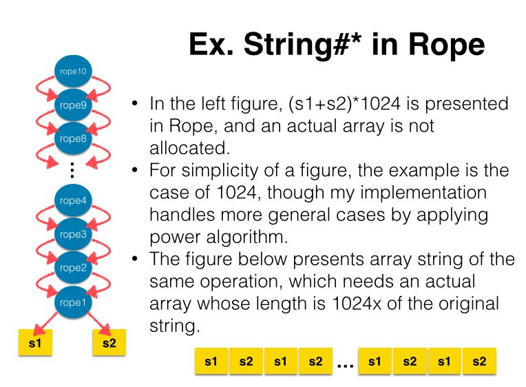
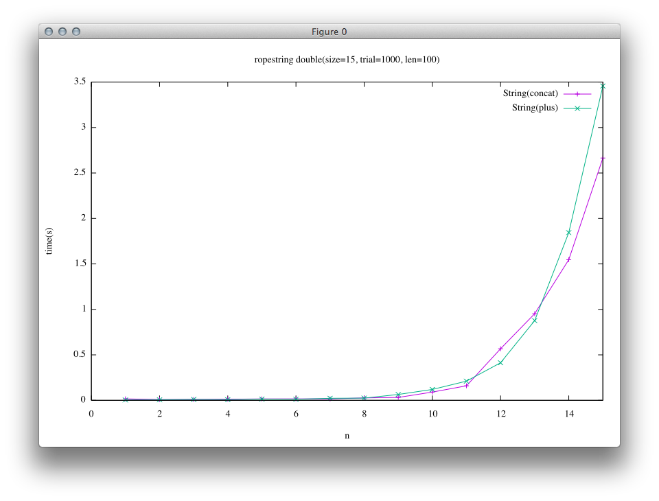
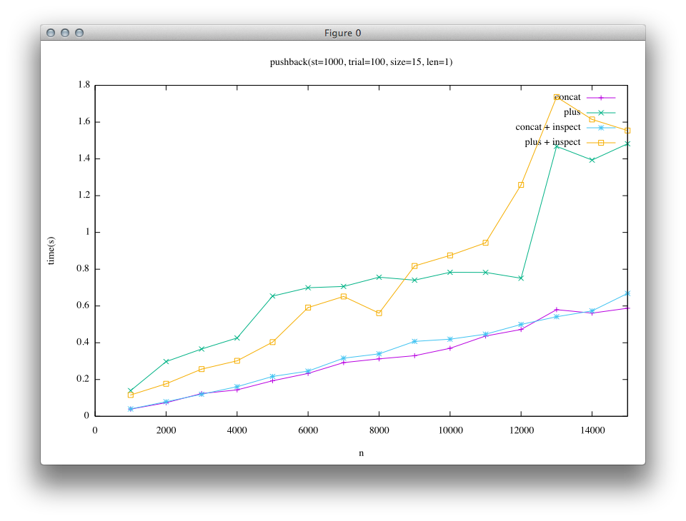
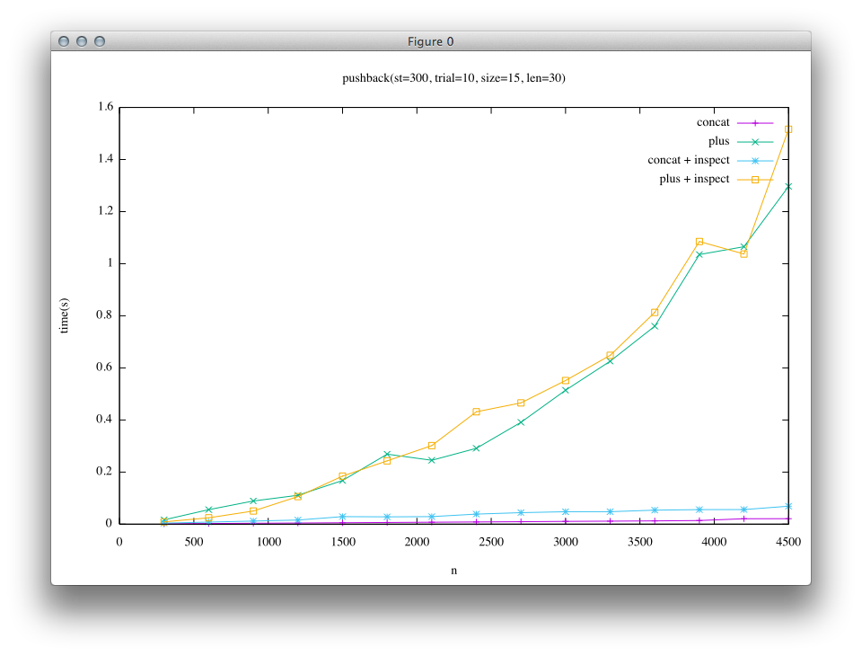

[日本語のページ]({{site.url}}{{site.baseurl}}/gsoc2016/japanese)

This page is a report of my project in Google Summer of Code(GSoC)2016.
[Automatic-selection mechanism for data structures in MRI](https://summerofcode.withgoogle.com/projects/#4576418910437376)

## Acknowledgement
I would like to express my best thanks to Mr. Koichi Sasada for mentoring whole my project. His great insight into Ruby helps me much and provides me much more interesting discussions beyond the range I actually have worked on.
I also would like to thank those who manage Google Summer of Code for offering students including me with the precious opportunity in this summer.

## What I did
* [Rope](#rope)
  * [Implement Ruby Rope C extension and experimental automatic selection class](#rope-extension)
    * Github: <https://github.com/spinute/CRope>
    * Whole repository is for this project
  * Implement Rope into Ruby-Core and its automatic selection for String class
    * <https://github.com/spinute/ruby/tree/implement_ropestring>
    * "implement-ropestring" branch is for this section of the project
* Implement patches for Ruby core which enables concat and prepend methods in Array and String class to take multiple arguments
  * <https://bugs.ruby-lang.org/issues/12333> (3 patches are posted)
* Merge a well-tuned hashtable into Ruby core (in progress)
  * <https://github.com/spinute/ruby/tree/stbench/ext/stbench>
  * Whole repository is for this project


## Introduction
TODO: merge japanese.md
Note: There are several implementations of Ruby language e.g. MRI(Matz Ruby Interpreter, written in C), JRuby(in Java), Rubynius(in C++ and Ruby itself) ...etc. In this report, I have written Ruby as MRI.

<a name="rope"></a>

## Rope String
TODO: merge japanese.md

Classical implementation of string object in programming language is a sequential buffer such as array in C language, and Ruby has also adopted such a structure for string.
Rope is another data structure for string object, which expresses a given string in a tree structure.
Rope surpasses array-expression in some basic operations especially in the meaning of time complexity, e.g. concatenation, deletion and substring.

My main challenge in Google Summer of Code 2016 (GSoC2016) is to introduce Rope into Ruby and enable users to enjoy its efficiency unconsciously.
In some languages which place their emphasis on efficiency, explicit data structures are required to write an efficient program.
However, that is not the approach Ruby has selected.
Ruby users tend to use a few data structures prepared in the language and they usually do not want to dive into the depth of selecting proper data structures for efficiency.
In this way, Ruby provides users with productivity and the joy of programming, and I have contributed to that virtue by offering automatic data structure selection mechanism which enables users to use efficient data structures transparently.

## Background
言語処理系における文字列のオブジェクトの実装として、連続したメモリ領域(例えばC言語の配列など)を使って文字列を表現するものがあります。
Rubyでも現状の文字列の実装はこれを採用しています。

<a href="image/array_string.png">  </a>

他の文字列の実装として、木構造の表現であるRope[https://en.wikipedia.org/wiki/Rope_(data_structure)](Wikipedia)というデータ構造があります。(Boehm, Hans-J, Atkinson, Russ, Plass, Michael; 1995)
最も単純なレパートリーでは、木構造は二分木とし、葉は配列を素朴に使って表現した文字列を、内部ノードは自身を根とする木の葉ノードを左から順に並べた文字列を表現します。

<a href="image/rope.png">  </a>

すなわち、以下のようにしてRopeによる文字列の表現から配列による文字列の表現への変換が可能です。

* ropeが葉の場合 get-string(node) = nodeの文字列
* そうでない場合 get-string(node) = get-string(nodeの左の子) + get-string(nodeの右の子)

このデータ構造では文字列の削除や結合、部分文字列の取得などの操作を配列による文字列表現の場合と比較して効率的に行うことができます。

このようにデータ構造にはそれぞれ優位な操作がありますが、Rubyの処理系はユーザーに多くのデータ構造を使い分けることを課すデザインになっていません。
これは最も素朴なデータ構造のうちのひとつであるListがRubyには用意されていないことからも見てとれます。
Rubyのユーザーは多くの場合、Stack/Queue/List...などのデータ構造の処理を、多用なメソッドを備えたArrayを使って達成します。
ユーザーは低レベルなデータ構造の選択から解放され、より抽象度の高い仕事において生産性を発揮することができるのです。
一方で、用途に応じて真に効率的なデータ構造は異なり、それらを適切に使い分けることでより効率的な処理が行えることも事実です。

このプロジェクトでは、従来通りユーザーにはデータ構造を選択する複雑性を意識させることなく、処理系の内部でデータ構造を動的に切り替えることで、ユーザに対して透過的にデータ操作の効率性を提供することを目指しました。

具体的には、文字列の実装として既存の配列ベースのものとは別に、Ropeと呼ばれる木構造による表現を実装し、Ropeが有利な処理が文字列に適用される際には文字列の内部表現を自動的にRopeに切り替えるようにしました。
Rubyのアプリケーションとして重要な、WebサーバーでのHTMLファイルの生成RDocによるドキュメント生成などを意識し、結合を中心にいくつかの文字列操作が高速に行えるRopeを実装しましたが、ListやGapBufferなど他のデータ構造をStringクラスに実装したり、あるいはArrayクラスにおいても同様の工夫を行ったりすることも今回と同様の方法で可能だと考えています。

ここで、Ropeによる文字列表現の利点のひとつとして、Rubyの既存の実装における問題点を例に挙げ説明をします。

Rubyには文字列の結合を行うためのメソッドとして+と<<の2種類があります。(concatというものもありますが、この実装は<<と同じです。)
前者は非破壊的に文字列を結合した結果を返すメソッドであり、後者は破壊的に文字列を結合するメソッドです。
既存の実装においては前者の処理が遅く、<<メソッドを利用することができる場面ではこちらを利用する、というハックがあります。
このプロジェクトの実装によって、+メソッドを利用した際にも<<メソッドを使用した場合と大差ない性能を透過的に得られるようになりました。

2つの結合を行うメソッドの内部的な振る舞いを説明します。(実際には、短い文字列はオブジェクトの内部に埋め込まれる最適化がRubyでは行われますが、ここでは簡単のため無視しています)

<a href="image/plus_old.png">  </a>

+メソッドの振る舞いとして、a+bを行うとき、aとbを結合した後の文字列を保持するのに十分なバッファを作成し、そこにa、bの内容をコピーする処理が毎回行われます。

<a href="image/concat.png">  </a>

一方で<<メソッドでは、a << bを行うときaの持つバッファにbをコピーします。この際にaが十分なバッファを持っている場合にはbだけがコピーされ、aのバッファが足りない時に限り新たに拡張したバッファを確保し、そこにaとbをコピーする、という処理を行います。

そのため、+では呼び出し回数だけa,bが共にコピーされ、また常に新たなオブジェクトが生成されているのに対して、<<においてはオブジェクトの生成とaのコピーはバッファが不足するときのみ発生することになります。
バッファの拡張は指数的に行われるため、例えばある文字列を繰り返し末尾に連結する処理におけるコピーされる文字列の量を考えると、+では最終文字列長の二乗オーダーである一方で、<<では高々3倍程度とオーダーレベルで差があります。


ここで、Ropeにおける+演算の説明を行います。

<a href="image/plus_rope.png">  </a>

今回の実装ではRopeはimmutableなデータ構造として実装しました。
Ropeは結合演算の結果を遅延評価するデータ構造と考える事ができます。
+操作自体は2つのノードを指すポインタを保持するだけなので定数時間で実行できます。
実際に連結された文字列を取り出すときに木を辿り、葉に入っている文字列を集めた文字列オブジェクトを生成します。
この処理は実際に配列表現の文字列が必要になった時になってから実行され、最終的な文字列のサイズがわかるため、先ほどの+での結合時に毎回発生していたの文字列のコピーや、<<で必要に応じて行っていたバッファの拡張などが不要になっています。

他にも部分文字列の取得や、中間文字の削除などの演算もRope表現を持つ文字列に対して適用した場合には計算量的に優位に実行することが可能です。

これまでは、これらの計算量的に優位なデータ構造をユーザーが明示的に利用するためのRope実装は存在していましたが、これはRubyレベルで記述された拡張ライブラリでした。
このプロジェクトの成果のひとつとして、C言語での拡張ライブラリの実装を行いました。
また、ユーザーからみて透過的にRopeが利用される、動的なデータ構造の自動選択をRuby処理系のStringクラスに実装しました。

<a name='rope-extension'></a>

## Ruby Rope C extension and experimental automatic selection class
TODO: merge japanese.md

Firstly, I implemented Rope as an extension written in C.
The purpose of this implementation is prototyping; I was novice to Ruby's internal before the project, so I divided complexities in the implementation of Rope string and the modification of the behavior of Ruby.
I implemented Rope by not using Garbage Collector in Ruby core but by using reference count which I prepared by myself for simplicity.
However, reference counting visits all the nodes in a tree when calling concat or delete methods, and hence these methods become slower than that of ideal time complexity of Rope data structure.
The purpose of prototyping is to ensure the possibility of the project, and I succeeded to evaluate the performance of the ideal implementation of Rope by turning off the reference counting, meaning this extension includes memory leaks for accomplishing ideal performance, and it is the reason why I did not provide its extension as RubyGem (Package Management System for Ruby Language).
I decided to leave this problem because I tried implementing Rope string into Ruby interpreter itself and the problem automatically vanished by using Garbage Collector in Ruby.

<a name='rope-string'></a>

## Implementation of Rope into Ruby core
TODO: merge japanese.md

At last, I implemented Rope into String class of Ruby interpreter.
When String#concat is called, a state of String object changes into Rope.
On the other hand, when string as an array is needed, Rope string is converted into array string automatically.

As a note, in my proposal, I thought of the problem in wider scope.
The efficiency of the operation is determined by the state of the data, and its expression as a data structure.
For example, to hold sequence of characters, when Array is used then random accessing by index is performed efficiently, on the other hand, when List is used then insertion or deletion of internal characters is efficient, while its not efficient in Array case.
Ruby has offered Array as universal data structure, and not offer other normal data structures such as List, Queue, Stack.
This design is easy to use and provides users with concentration on their high level tasks, however, sometimes it is proved to be inefficient.
The goal of this project is to develop a mechanism which uses multiple data structures internally and switches them dynamically, and, on the other hand, which looks just a normal object for users.

During a life of an object

Ropeの利点を活かすために以下のような最適化を実装しました。

1. 先頭あるいは末尾に埋め込み可能な文字列を追加する際にて新たにノードを追加しない
2. String#+以外のメソッドによるRopeの構築
3. Ropeに対して直接実行可能なメソッドの実装

#### 先頭あるいは末尾に埋め込み可能な文字列を追加する際には埋め込みを行う
実際のアプリケーションの中で多くある文字列の結合の仕方として、末尾に短い文字列を結合することを繰り返す、というものです。
文書を先頭から順に構築して行ったり、行を結合して改行記号を結合してという処理を考えるとこれは多くの実アプリケーションで現れています。

このようなとき、Ropeの+演算で木を構築すると、左に非常に傾いた木ができてしまい、処理の効率がよくありません。
ここで、Rubyの配列表現の文字列では短い文字列はバイト列としてオブジェクトに対応するCの構造体に直接埋め込む、という最適化があります。
文字列の先頭あるいは末尾に対して、現在先頭の文字あるいは末尾の文字を含んでいる葉に足しいて埋め込み可能な文字列を追加する際には下の図のような埋め込みによる結合を行うことで木が深くなることを抑制する最適化を実装しました。

<a href="image/embed_optimization.png">  </a>

#### String#+以外のメソッドによるRopeの構築
+以外ではString#\* においてもRopeのまま処理を行うことで繰り返しを遅延する実装をしています。
引数文字列を組み合わせたり繰り返したりして新たな文字列を生成する他のメソッド(例えばString#\* )においても同様の方法で遅延が可能なはずです。
あまり役に立つ実例が見つかっていないのですが、大きな文字列を作るが、その一部分しか利用しない場合や、結果文字列の性質のみを知りたい場合、実際の文字列を生成する必要がない利点が生きてくるかもしれません。(例. str * 1000000などをすると、既存の実装ではこの処理の実行時にstrの1000000倍の長さを持つ文字配列が作成されますが、Ropeでは結果の文字列を実際に配列として使うまで、配列は作らず、また例えば文字列長などの性質や部分文字列は実際に文字列全体を作成せずに得る事ができます。)

<a href="image/multi_rope.png">  </a>

#### Ropeに対して直接実行可能なメソッドの実装

下に述べる性能評価を見るとわかるように、大きな文字列に対応するRopeは、結合による構築は非常に高速ながら、配列形式の文字列への変換に大きなコストがかかっていることがわかります。
最終的に文字列の全体が必要ない場合には、Ropeに対してそのまま処理を施すことができるメソッド。

このような最適化が可能なメソッドの例としては、部分文字列の取得や文字毎の繰り返し処理などがあります。
これを行うためには、Stringクラスのメソッドに対して、オブジェクトがRopeであった際に配列文字列の場合と等価な結果を計算する処理を実装する必要があります。

今回は部分文字列の取得のみ実装を行いました。

<a href="image/substr_rope.png">  </a>


### 性能評価

実験のパラメータはグラフのタイトルに埋め込んであります。

* size: 実験のスケール
* len: 結合する文字列の長さ
* trial: 試行回数

いずれも、左の列がtrunk(e5c6454efa01aaeddf4bc59a5f32d5f1b872d5ec)での計測結果、右の列がこのプロジェクトの計測結果です。

#### 文字列を倍々にする
以下の様なプログラムでベンチマークを取りました。
このベンチマークではある文字列を左右の子とする新たな文字列を生成するので、Ropeの木が完全にバランスします。

```ruby
# String(concat)
e = String.new "a"*len
n.times { e << e }

# String(plus)
e = String.new "a"*len
n.times { e += e }
```

<a href="image/double_concat_trunk_only.png"></a>
<a href="image/double_concat_rope_only.png"></a>

Ropeの結果(右のグラフの緑色の結果)を比較すると他の結果と比べて極めて小さな時間で実行できているのがわかると思います。
これはRopeの結合処理では文字列の参照を取得するだけであるのに対して、trunkの実装では結合字に結果文字列を実際に作成しているためです。

続いては、上の処理に加えて、結合後の文字列に対して配列文字列を必要とする処理を実行するベンチマークです。

```ruby
# String(concat)+inspect
e = String.new "a"*len
n.times { e << e }
e.inspect

# String(plus)+inspect
e = String.new "a"*len
n.times { e += e }
e.inspect
```

<a href="image/double_concat_trunk.png"></a>
<a href="image/double_concat_rope.png"></a>

この結果を見てみると、先の実験ではRopeの結合処理が高速であった点が、この実験結果では隠れていることがわかるかと思います。

#### 一定の長さの文字列を末尾に結合していく
このベンチマークでは、文字列を末尾に結合していきます。
この場合、Ropeの木は左に傾いた木になります。

```ruby
# String(concat)
s = String.new "a"*len
n.times { e << s }
e.inspect  # +inspectの場合

# String(plus)
s = String.new "a"*len
n.times { e += s }
e.inspecta # +inspectの場合
```

1つ目の結果は短い文字列(len=1)を末尾に追記することを繰り返した結果です。

<a href="image/append_concat_trunk_short.png"></a>
<a href="image/append_concat_rope_short.png"></a>

2つ目の結果は長い文字列(len=30)を末尾に追記することを繰り返した結果です。(実行回数trialを少なめにしています)

<a href="image/append_concat_trunk_long.png"></a>
<a href="image/append_concat_rope_long.png"></a>

結果を見ると、左の列(trunkでの比較)では<<に対して+の実行時間が非常に大きいことがわかります。
このため、現在のRubyユーザーの知見として、"+は遅いので<<を使う"ということになっています。

一方で、右の列(Rope実装後の比較)では、短い文字列の場合ではtrunkと比べると<<と+の差が小さくなっていることがわかります。
大きい文字列の場合には、trunkでは緑と黄色の列(+)と紫と青の列(<<)で結果が大きく離れていたのに対して、Ropeの結果では青と黄色(+と<<にinspectを加えたもの)、緑と紫(+と<<)で似た結果になっていることがわかり、Ropeの実装によって+においても<<に近い性能が得られるようになっていることがわかります。

### まとめと課題
Rope文字列の実装を拡張ライブラリとして実装した後、Ruby処理系のStringクラスに実装しました。
結合処理は定数時間で実行できることを確認し、既存の+メソッドによる文字列の結合の性能を改善することを確認しました。

実験結果をみると、結合処理自体はRopeで行うのが圧倒的に早いにもかかわらず、配列表現の結果文字列全体を最終的に必要とするような用途では、Ropeと配列表現の文字列の変換コストによって<<とRope上の+の差がない、という結果になっています。
2,3つめの最適化について、今回は限られた数のメソッドしか実装することができていませんが、実装したメソッドの他にも最適化が可能なメソッドがあり、Ropeとして大きな文字列を作り、Ropeのままで文字列を処理してから比較的小さな結果文字列を得られるような実用的なシナリオがあれば、Ropeを導入しなければ達成できない高速化が達成できるのではないかと考えています。
実際のアプリケーションの中で、大きなRope文字列に対して適用されることの多いメソッド調査し、その効率的なRope実装が可能であれば行うことは最適化の可能性としてやり残されています。

残された問題点としてテストケース(make test-all)のうち、以下のものがまだ安定して通過していません。([implement_ropeブランチ: 250deede](https://github.com/spinute/ruby/commit/250deedef4bf253238f53559db26cd9c4793b6ec), OSX 10.9.5にて実行)

* TestSocket_UDPSocket#test_send_no_memory_leak(test/socket/test_udp.rb:94)
* TestProcess#test_deadlock_by_signal_at_forking(test/test_process.rb:2103)
* test/rss
* test/rexml

<a name="issue12333"></a>

## Post patches for issue#12333
TODO: merge japanese.md

During my Community Bounding Period, I read two books ["Ruby Hacking Guide"](https://ruby-hacking-guide.github.io/) and ["Ruby Under a Microscope"](https://www.nostarch.com/rum), and official online resources such as [Ruby C API reference](http://docs.ruby-lang.org/en/trunk/extension_rdoc.html), [Ruby Wiki](https://bugs.ruby-lang.org/projects/ruby/wiki/).
After that I selected an issue posted in [Bug Tracker System of Ruby](https://bugs.ruby-lang.org/issues) at the perspective of having relations with the topic in this project without going too complicated.
I selected this issue [\"String#concat, Array#concat, String#prepend to take multiple arguments\"](https://bugs.ruby-lang.org/issues/12333) as my first activity diving into Ruby internal , and implemented a feature that enables methods such as concat and prepend in Array and String to have multiple arguments.
I discussed some details and possible implementations in the page, and posted 3 patches.
I also reported this implementation in a developer's meeting in July, and received some feedbacks about implementation from Ruby committers and a positive response for this feature from Matz.

<a name='hashtable'></a>

## Rubyの内部で使用されているハッシュテーブルの実装の改良提案のベンチマーク実装

<https://github.com/spinute/ruby/tree/stbench/ext/stbench>

このプロジェクト期間の最後の1週間ほどで、<https://bugs.ruby-lang.org/issues/12142>の追加評価を試みました。

このissueは、RubyのHashクラスに加え、内部実装でも利用されているハッシュテーブルを改良しようという提案です。
まず、Vladimir Makarov氏がOpen Addressingを使った実装を公開し、議論を行う中で、Yura Sokolov氏がopen addressingを利用せずに先の実装に近い性能を出す別の実装を公開しており、2つの実装と既存の実装との評価比較が待たれている状態です。
両者とも数ヶ月の議論を経て実装が洗練されてきており、Rubyへのマージされる意義の高い提案だと考え、最後の1週間でこの作業に取り組むことにしました。

現在、Rubyに付属するベンチマークに既にいくつかの処理がRubyでいくつかシナリオが記述されており、両実装のこの結果は既に投稿されています。
これに加え、ハッシュテーブル自体の単一の操作の性能評価をするベンチマークを書くと、より定量的な評価に基づく議論が可能になるのではないかということで、このベンチマークを実装することにしました。

実装としては、Rubyの拡張ライブラリとしてベンチマークを行うためクラスを作り、そこからCで記述したシナリオをRubyレベルで渡したパラメータで選び、ベンチマークの実行はCの関数で完結するように書いてあります。ちなみに拡張ライブラリとして実装することにしたのは、Rubyのソースコードと結合のあるRubyのハッシュテーブルのコード(st.c)のビルドを簡単に行うためです。

<https://github.com/spinute/ruby/blob/stbench/ext/stbench/stbench.c>にSTBenchクラスの実装が記述されています。
全てのベンチマークは~\_setup -> ~\_run -> ~\_cleanupという3段階の処理で実装されており、この順で実行されることを想定しています。(使い方の例は後述します。)

現状の機能としては、

* 処理回数
* テーブルの初期サイズ
* キーの種類 := 整数、(長い、短い)文字列
* キーの選択 := 全て同じもの、全て別のもの、母集団からランダムに選ぶ
* オペレーション := insert、delete、search、テーブルの初期化&削除

の組み合わせについてベンチマークを実行できるようにしました。

計測しているのは実行時間と、ベンチマーク前後のMax RSSです。

ベンチマークを実行するプログラムの例は以下のようになります。

```ruby
# Set benchmark parameter
keytype='num'; ht_init_size=0, scale=10; patter='rand'

# Fork a process to measure memory usage separately
pid = Process.fork do
  bench = STBench.new
  bench.search_setup keytype, ht_init_size, scale, pattern
  puts Benchmark.measure { bench.search_run }
  bench.search_cleanup
end
Process.waitpid pid
```

下のような結果が出ます。

<pre>
Insert bench: keytype=num,    pattern=rand,   scale=10,    ht_init_size=0, keylen=5
  0.890000   0.040000   0.930000 (  0.933727)
  before:    4730880, after:   39747584, diff  35016704
</pre>

ベンチマーク結果の読み方は、一行目がパラメータで以下の

* キーは整数でランダムに生成する
* 10 * 00000回挿入を行う
* テーブルの初期サイズは未指定

二行目が実行時間です。(Rubyレベルでbenchmarkライブラリを使って計測しています。)

三行目がgetrusage(2)で取得したMax RSS(初期化完了時、ベンチマーク完了後、その差分)です。

<https://github.com/spinute/ruby/blob/stbench/ext/stbench/bench.rb>ベンチマークを一通りのパラメータの組み合わせに対して実行するサンプルプログラムが記述してあります。

ハッシュテーブルのAPIに含まれているforearch系の関数に対してのベンチマークも実装し、各パッチと既存の実装とのベンチマークを取り、実装者達の意見を伺いながら評価に必要な項目を追加するのは今後の課題です。
