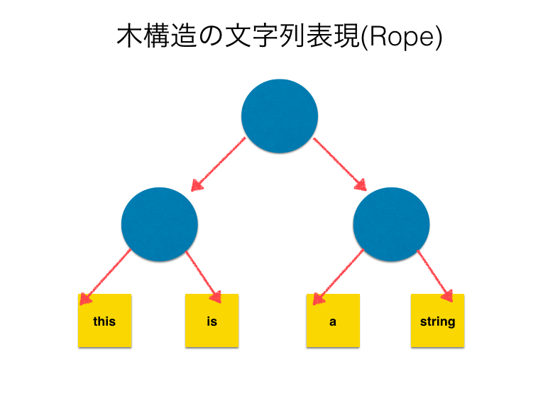
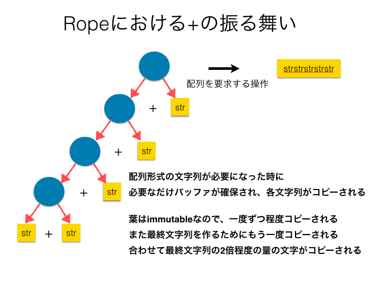
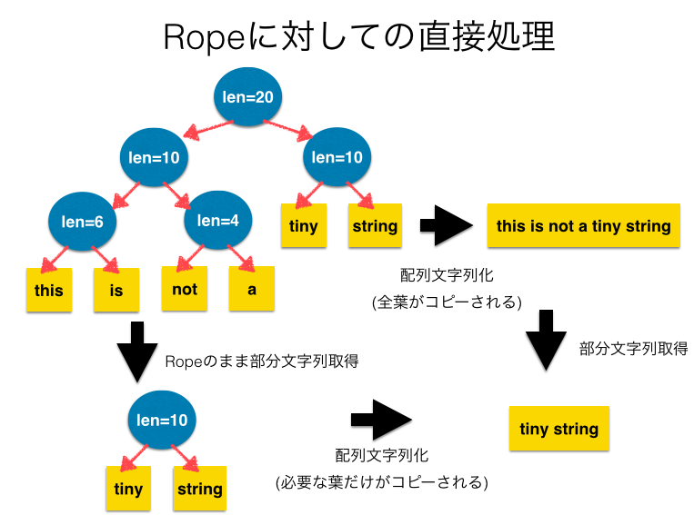

[English Page]({{site.url}}{{site.baseurl}}/gsoc2016/english)

このページは[Google Summer of Code(GSoC)](https://summerofcode.withgoogle.com/)2016に採択された提案[Automatic-selection mechanism for data structures in MRI](https://summerofcode.withgoogle.com/projects/#4576418910437376)の成果報告ページです。

## 謝辞

このプロジェクトでメンターを務めていただいたメンターの笹田さんには4ヶ月近くに渡り連絡を取り合いながら、Rubyの内部実装からデバッグまでご協力いただき大変お世話になりました。Rubyに関するネタの引き出しはさすがに広く深く、短い期間のプロジェクトの中で実際に手を付けられたのはわずかな範囲でしたが、関連する面白いお話をたくさん聞くことができ楽しかったです。
また、Google Summer of Codeの実施に携わるみなさまにも、僕を含む多くの学生にこのような貴重な場を提供していただけたこと、感謝しています。

## 成果物
* [Rope関連](#rope)
  * [C言語で実装されたRope拡張ライブラリの実装](#rope-extension)
    * Githubレポジトリ: <https://github.com/spinute/CRope>
    * このプロジェクトの一環として作られたレポジトリです
  * [Rubyの文字列のRopeを使った内部表現の実装](#rope-string)
    * Githubレポジトリ: <https://github.com/spinute/ruby/tree/implement_ropestring>
    * implement-ropestringブランチがこの作業ブランチです
* その他
  * [issue#12333: RubyのArray, Stringクラスのprepend, concatを多引数化するパッチの実装](#issue12333)
    * Issue: <https://bugs.ruby-lang.org/issues/12333> にて議論を行い、考えられる幾つかの実装パッチを投稿しています
  * [Rubyのハッシュテーブルの改良提案の評価のためのベンチマーク実装(作業途中)](#hashtable)
    * Githubレポジトリ: <https://github.com/spinute/ruby/tree/stbench/ext/stbench>
    * このプロジェクトの一環として作られたレポジトリです


## はじめに

このページでは、RubyというとRuby処理系のうちのひとつであるMRI(Matz Ruby Interpreter)のことを指します。
他の有名な処理系実装の例として、Javaによる実装であるJRubyや、C++によりVMを実装しその他の大部分をRubyによって実装しているRubiniusなどがあります。
これらの処理系についてはMRIと共通する部分も多いと思うのですが、必ずしもそうではないことにはご注意ください。

<a name="rope"></a>

## データ構造Ropeを使った文字列の実装

このプロジェクトの中心となるRubyの文字列クラスへの木構造表現の実装とその動的/自動的な切り替えの話を記述します。


### 背景
言語処理系における文字列のオブジェクトの実装として、連続したメモリ領域(例えばC言語の配列など)を使って文字列を表現するものがあります。
Rubyでも現状の文字列の実装はこれを採用しています。

<a href="image/array_string_jp.png">  </a>

他の文字列の実装として、木構造の表現であるRope[https://en.wikipedia.org/wiki/Rope_(data_structure)](Wikipedia)というデータ構造があります。(Boehm, Hans-J, Atkinson, Russ, Plass, Michael; 1995)
最も単純なレパートリーでは、木構造は二分木とし、葉は配列を素朴に使って表現した文字列を、内部ノードは自身を根とする木の葉ノードを左から順に並べた文字列を表現します。

<a href="image/rope_jp.png">  </a>

すなわち、以下のようにしてRopeによる文字列の表現から配列による文字列の表現への変換が可能です。

* nodeが葉の場合 get-string(node) = nodeの文字列
* そうでない場合 get-string(node) = get-string(nodeの左の子) + get-string(nodeの右の子)

このデータ構造では文字列の削除や結合、部分文字列の取得などの操作を配列による文字列表現の場合と比較して効率的に行うことができます。

このようにデータ構造にはそれぞれ優位な操作がありますが、Rubyの処理系はユーザーに多くのデータ構造を使い分けることを課すデザインになっていません。
これは最も素朴なデータ構造のうちのひとつであるListがRubyには用意されていないことからも見てとれます。
Rubyのユーザーは多くの場合、Stack/Queue/List...などのデータ構造の処理を、多用なメソッドを備えたArrayを使って達成します。
ユーザーは低レベルなデータ構造の選択から解放され、より抽象度の高い仕事において生産性を発揮することができるのです。
一方で、用途に応じて真に効率的なデータ構造は異なり、それらを適切に使い分けることでより効率的な処理が行えることも事実です。

このプロジェクトでは、従来通りユーザーにはデータ構造を選択する複雑性を意識させることなく、処理系の内部でデータ構造を動的に切り替えることで、ユーザに対して透過的にデータ操作の効率性を提供することを目指しました。

具体的には、文字列の実装として既存の配列ベースのものとは別に、Ropeと呼ばれる木構造による表現を実装し、Ropeが有利な処理が文字列に適用される際には文字列の内部表現を自動的にRopeに切り替えるようにしました。
Rubyのアプリケーションとして重要な、WebサーバーでのHTMLファイルの生成、RDocによるドキュメント生成などを意識し、結合を中心にいくつかの文字列操作が高速に行えるRopeを実装しましたが、ListやGapBufferなど他のデータ構造をStringクラスに実装したり、あるいはArrayクラスにおいても同様の工夫を行ったりすることも今回と同様の方法で可能だと考えています。

ここで、Ropeによる文字列表現の利点のひとつとして、Rubyの既存の実装における問題点を例に挙げ説明をします。

Rubyには文字列の結合を行うためのメソッドとして+と<<の2種類があります。(concatというものもありますが、この実装は<<と同じです。)
前者は非破壊的に文字列を結合した結果を返すメソッドであり、後者は破壊的に文字列を結合するメソッドです。
既存の実装においては前者の処理が遅く、<<メソッドを利用することができる場面ではこちらを利用する、というハックがあります。
このプロジェクトの実装によって、+メソッドを利用した際にも<<メソッドを使用した場合と大差ない性能を透過的に得られるようになりました。

2つの結合を行うメソッドの内部的な振る舞いを説明します。(実際には、短い文字列はオブジェクトの内部に埋め込まれる最適化がRubyでは行われますが、ここでは簡単のため無視しています)

<a href="image/plus_old_jp.png">  </a>

+メソッドの振る舞いとして、a+bを行うとき、aとbを結合した後の文字列を保持するのに十分なバッファを作成し、そこにa、bの内容をコピーする処理が毎回行われます。

<a href="image/concat_jp.png">  </a>

一方で<<メソッドでは、a << bを行うときaの持つバッファにbをコピーします。この際にaが十分なバッファを持っている場合にはbだけがコピーされ、aのバッファが足りない時に限り新たに拡張したバッファを確保し、そこにaとbをコピーする、という処理を行います。

そのため、+では呼び出し回数だけa,bが共にコピーされ、また常に新たなオブジェクトが生成されているのに対して、<<においてはオブジェクトの生成とaのコピーはバッファが不足するときのみ発生することになります。
バッファの拡張は指数的に行われるため、例えばある文字列を繰り返し末尾に連結する処理におけるコピーされる文字列の量を考えると、+では最終文字列長の二乗オーダーである一方で、<<では高々3倍程度とオーダーレベルで差があります。


ここで、Ropeにおける+演算の説明を行います。

<a href="image/plus_rope_jp.png">  </a>

今回の実装ではRopeはimmutableなデータ構造として実装しました。
Ropeは結合演算の結果を遅延評価するデータ構造と考える事ができます。
+操作自体は2つのノードを指すポインタを保持するだけなので定数時間で実行できます。
実際に連結された文字列を取り出すときに木を辿り、葉に入っている文字列を集めた文字列オブジェクトを生成します。
この処理は実際に配列表現の文字列が必要になった時になってから実行され、最終的な文字列のサイズがわかるため、先ほどの+での結合時に毎回発生していたの文字列のコピーや、<<で必要に応じて行っていたバッファの拡張などが不要になっています。

他にも部分文字列の取得や、中間文字の削除などの演算もRope表現を持つ文字列に対して適用した場合には計算量的に優位に実行することが可能です。

これまでは、これらの計算量的に優位なデータ構造をユーザーが明示的に利用するためのRope実装は存在していましたが、これはRubyレベルで記述された拡張ライブラリでした。
このプロジェクトの成果のひとつとして、C言語での拡張ライブラリの実装を行いました。
また、ユーザーからみて透過的にRopeが利用される、動的なデータ構造の自動選択をRuby処理系のStringクラスに実装しました。

<a name='rope-extension'></a>

### C言語で実装されたRope拡張ライブラリ

はじめに、Ropeが文字列における一部の処理を高速化することを確認するため、拡張ライブラリとしてRopeを実装しました。

今回はC言語で実装したRopeをRubyでラップする形で実装を行いました。
CData型というC言語の構造体をRubyオブジェクトのデータとして持たせるための型があり、これを利用しました。
Rope構造体はメンバ変数として、左右の子を指すポインタと、自身を根とする木構造の表現する文字列の長さを持っています。

ここで実装したRopeは<https://github.com/spinute/CRope/blob/master/ext/rope/rope.h>にあるような操作を提供します。
特に、文字列の基本的な操作としては、結合、部分文字列の取得/削除、インデックスアクセス、イテレータによるアクセスを提供します。
また、配列表現の文字列を得るための関数としてRopeToStringが用意されています。

また、Rubyオブジェクトとしては木構造の全てのノードがそれぞれRubyのオブジェクトとなるため、Rubyのオブジェクトをノード数だけ生成するオーバーヘッドがあります。

既存のRopeの実装はRubyレベルでのものはあったものの、今回の実装はCレベルで行い、拡張ライブラリとしてRuby処理系に組み込みました。
また、オブジェクトの回収はRubyレベルではGCを使って行われているのですが、拡張ライブラリを作成する段階ではGCの動作をまだよく理解していなかったため、オブジェクトに参照カウントを埋め込んで、メモリの管理は独自に行いました。

参照カウントGCを自力で行う選択をしたことにより、文字列の結合や削除を行う際に木の内部の全てのノードの参照カウントを増減する必要が出てしまいます。
しかしながら、参照カウントの操作を行わないようにすると(実際にはメモリリークしているものの)理論通りの性能が出ることが確認でき、Ruby処理系に組み込む際にはRubyのGCを使いこの問題は解決されるため、ここではこの問題は放置することにしました。

<a name='rope-string'></a>

### Ruby文字列実装のRope対応
今回のプロジェクトの中心となる成果として、Ruby処理系における組み込みStringクラスを修正し、文字列の内部的な表現としてRopeを使うものを実装しました。
Rubyのオブジェクトの状態を示すフラグに、文字列オブジェクトがロープであることを示すフラグを作りました。(FL_USER_0をSTR_IS_ROPEとした)

String#+が呼ばれ、埋め込み文字列で表現可能な長さを越える文字列が生成される場合に、その出力がRope表現になります。
この際に、子ノードが直接変更可能なものである場合には、変更不可能な同じ文字列を持つオブジェクトを生成し、その参照を葉に持ちます。
すなわち、Rubyの文字列はmutableですが、Ropeはimmutableな文字列になっています。
その後、配列形式の文字列が必要となる時点で、Rope表現の文字列は配列表現の文字列に変換されます。

+によるRopeの構築は結合処理の実行を遅延していると考えることができます。
先に述べた既存の+や<<などは結合処理を逐次行うのに比べ、Ropeの+は実際に結合後の文字列が必要になったタイミングで文字列の結合を行います。
このため、+の処理自体は処理する文字列の長さに関係なく高速に行えます。

Ropeの利点を活かすために以下のような最適化を実装しました。

1. 先頭あるいは末尾に埋め込み可能な文字列を追加する際にて新たにノードを追加しない
2. String#+以外のメソッドによるRopeの構築
3. Ropeに対して直接実行可能なメソッドの実装

#### 先頭あるいは末尾に埋め込み可能な文字列を追加する際には埋め込みを行う
実際のアプリケーションの中で多くある文字列の結合の仕方として、末尾に短い文字列を結合することを繰り返す、というものです。
文書を先頭から順に構築して行ったり、行を結合して改行記号を結合してという処理を考えるとこれは多くの実アプリケーションで現れています。

このようなとき、Ropeの+演算で木を構築すると、左に非常に傾いた木ができてしまい、処理の効率がよくありません。
ここで、Rubyの配列表現の文字列では短い文字列はバイト列としてオブジェクトに対応するCの構造体に直接埋め込む、という最適化があります。
文字列の先頭あるいは末尾に対して、現在先頭の文字あるいは末尾の文字を含んでいる葉に足しいて埋め込み可能な文字列を追加する際には下の図のような埋め込みによる結合を行うことで木が深くなることを抑制する最適化を実装しました。

<a href="image/embed_optimization_jp.png">  </a>

#### String#+以外のメソッドによるRopeの構築
String#+以外にも、引数文字列を組み合わせたり繰り返したりして新たな文字列を生成する他のメソッドにおいても、同様の方法でRope化が可能なはずです。
現在、+以外ではString#\* においてもRopeのまま処理を行うことで配列文字列の生成を遅延する機能を実装をしました。

あまり役に立つ実例が見つかっていないのですが、大きな文字列を作るが、その一部分しか利用しない場合や、結果文字列の性質のみを知りたい場合、実際の文字列を生成する必要がない利点が生きてくるかもしれません。(例. str * 1000000などをすると、既存の実装ではこの処理の実行時にstrの1000000倍の長さを持つ文字配列が作成されますが、Ropeでは結果の文字列を実際に配列として使うまで、配列は作らず、また例えば文字列長などの性質や部分文字列は実際に文字列全体を作成せずに得る事ができます。)

<a href="image/multi_rope_jp.png">  </a>

#### Ropeに対して直接実行可能なメソッドの実装

下に述べる性能評価を見るとわかるように、大きな文字列に対応するRopeは、結合による構築は非常に高速ながら、配列形式の文字列への変換に大きなコストがかかっていることがわかります。
最終的に文字列の全体が必要ない場合には、Ropeに対して直接処理を施すことができるメソッドを実装することで、最終的に不要になる部分を配列文字列として実体化せずに処理を終えることができるのです。

このような最適化が可能なメソッドの例としては、部分文字列の取得や文字毎の繰り返し処理などがあります。
これを行うためには、Stringクラスのメソッドに対して、オブジェクトがRopeであった際に配列文字列の場合と等価な結果を計算する処理を実装する必要があります。

今回は部分文字列の取得のみ実装を行いました。

<a href="image/substr_rope_jp.png">  </a>


### 性能評価

実験のパラメータはグラフのタイトルに埋め込んであります。

* size: 実験のスケール
* len: 結合する文字列の長さ
* trial: 試行回数

いずれも、左の列がtrunk(e5c6454efa01aaeddf4bc59a5f32d5f1b872d5ec)での計測結果、右の列がこのプロジェクトの計測結果です。

#### 文字列を倍々にする
以下の様なプログラムでベンチマークを取りました。
このベンチマークではある文字列を左右の子とする新たな文字列を生成するので、Ropeの木が完全にバランスします。

```ruby
# String(concat)
e = String.new "a"*len
n.times { e << e }

# String(plus)
e = String.new "a"*len
n.times { e += e }
```

<a href="image/double_concat_trunk_only.png"></a>
<a href="image/double_concat_rope_only.png"></a>

Ropeの結果(右のグラフの緑色の結果)を比較すると他の結果と比べて極めて小さな時間で実行できているのがわかると思います。
これはRopeの結合処理では文字列の参照を取得するだけであるのに対して、trunkの実装では結合時に結果文字列を実際に作成しているためです。

続いては、上の処理に加えて、結合後の文字列に対して配列文字列を必要とする処理を実行するベンチマークです。

```ruby
# String(concat)+inspect
e = String.new "a"*len
n.times { e << e }
e.inspect

# String(plus)+inspect
e = String.new "a"*len
n.times { e += e }
e.inspect
```

<a href="image/double_concat_trunk.png"></a>
<a href="image/double_concat_rope.png"></a>

この結果を見てみると、先の実験ではRopeの結合処理が高速であった点が、この実験結果では隠れていることがわかるかと思います。

#### 一定の長さの文字列を末尾に結合していく
このベンチマークでは、文字列を末尾に結合していきます。
この場合、Ropeの木は左に傾いた木になります。

```ruby
# String(concat)
s = String.new "a"*len
n.times { e << s }
e.inspect  # +inspectの場合

# String(plus)
s = String.new "a"*len
n.times { e += s }
e.inspecta # +inspectの場合
```

1つ目の結果は短い文字列(len=1)を末尾に追記することを繰り返した結果です。
このケースでは、短い文字列は先に述べた埋め込み文字列となっています。

<a href="image/append_concat_trunk_short.png"></a>
<a href="image/append_concat_rope_short.png"></a>

2つ目の結果は長い文字列(len=30)を末尾に追記することを繰り返した結果です。(実行回数trialを少なめにしています)
このケースでは、短い文字列は先に述べた埋め込み文字列にはなっていません。

<a href="image/append_concat_trunk_long.png"></a>
<a href="image/append_concat_rope_long.png"></a>

結果を見ると、左の列(trunkでの比較)では<<に対して+の実行時間が非常に大きいことがわかります。
このため、現在のRubyユーザーの知見として、"+は遅いので<<を使う"ということになっています。

一方で、右の列(Rope実装後の比較)では、短い文字列の場合ではtrunkと比べると<<と+の差が小さくなっていることがわかります。
大きい文字列の場合には、trunkでは緑と黄色の列(+)と紫と青の列(<<)で結果が大きく離れていたのに対して、Ropeの結果では青と黄色(+と<<にinspectを加えたもの)、緑と紫(+と<<)で似た結果になっていることがわかり、Ropeの実装によって+においても<<に近い性能が得られるようになっていることがわかります。

### まとめと課題
Rope文字列の実装を拡張ライブラリとして実装した後、Ruby処理系のStringクラスに実装しました。
結合処理は定数時間で実行できることを確認し、既存の+メソッドによる文字列の結合の性能を改善することを確認しました。

実験結果をみると、結合処理自体はRopeで行うのが圧倒的に早いにもかかわらず、配列表現の結果文字列全体を最終的に必要とするような用途では、Ropeと配列表現の文字列の変換コストによって<<とRope上の+の差がない、という結果になっています。
2,3つめの最適化について、今回は限られた数のメソッドしか実装することができていませんが、実装したメソッドの他にも最適化が可能なメソッドがあり、Ropeとして大きな文字列を作り、Ropeのままで文字列を処理してから比較的小さな結果文字列を得られるような実用的なシナリオがあれば、Ropeを導入しなければ達成できない高速化が達成できるのではないかと考えています。
実際のアプリケーションの中で、大きなRope文字列に対して適用されることの多いメソッド調査し、その効率的なRope実装が可能であれば行うことは最適化の可能性としてやり残されています。

残された問題点としてテストケース(make test-all)のうち、以下のものがまだ安定して通過していません。([implement_ropeブランチ: 250deede](https://github.com/spinute/ruby/commit/250deedef4bf253238f53559db26cd9c4793b6ec), OSX 10.9.5にて実行)

* TestSocket_UDPSocket#test_send_no_memory_leak(test/socket/test_udp.rb:94)
* TestProcess#test_deadlock_by_signal_at_forking(test/test_process.rb:2103)
* test/rss
* test/rexml

<a name="issue12333"></a>

## issue12333を実装したパッチの投稿
GSoCには実際にプロジェクトが始まる前の準備期間(community bounding periodと呼ばれています)が1ヶ月ほどあり、この期間に[Rubyソースコード完全解説](http://i.loveruby.net/ja/rhg/book/), [Rubyのしくみ Ruby Under a Microscope](http://tatsu-zine.com/books/ruby-under-a-microscope-ja)というRubyの実装を解説する二冊の文書に目を通しました。 また、開発者向けドキュメント[Ruby C API reference](http://docs.ruby-lang.org/en/trunk/extension_rdoc.html), [Ruby Issue Tracking System](https://bugs.ruby-lang.org/projects/ruby/wiki/)などにも目を通しました。

その後、Rubyの実装に実際に修正を加える体験をしてみようということで、RubyのIssueトラッカーに投稿されたissueの中から今回の対象範囲(String/Array/Hash)に関連のありそうなもので、かつ修正の方法の目処がつくものとして<https://bugs.ruby-lang.org/issues/12333>を選定し、仕様を議論しながら実装を何種類か投稿しました。

一考する余地のあった点としては、結合処理の際に、自身を引数に取るような実行をどのように処理するのが整合的な振るまいか、という点です。

```ruby
str = "a"
str.concat(str, str)
```

のようなプログラムを実行した際に、strは最終的に"aaa"となるべきか、あるいは"aaaa"になるべきか、というものです。
おそらくプログラムの意図としては前者が自然なのではないかと思うのですが、後者には`str.concat(str); str.concat(str)`というように二度メソッドを呼んだときの結果と一致する、という意味では整合性があります。
いずれのパッチも実装し、 7月のRuby開発者会議の際に開発者のみなさまにご意見を頂いたところ、前者が自然でいいだろう、とのご意見をいただきました。

また、コーディングスタイルについていくつかご指摘を頂いたので、その点を修正したパッチも再度投稿しました。

<a name='hashtable'></a>

## Rubyの内部で使用されているハッシュテーブルの実装の改良提案のベンチマーク実装

<https://github.com/spinute/ruby/tree/stbench/ext/stbench>

このプロジェクト期間の最後の1週間ほどで、<https://bugs.ruby-lang.org/issues/12142>の追加評価を試みました。

このissueは、RubyのHashクラスに加え、内部実装でも利用されているハッシュテーブルを改良しようという提案です。
まず、Vladimir Makarov氏がOpen Addressingを使った実装を公開し、議論を行う中で、Yura Sokolov氏がopen addressingを利用せずに先の実装に近い性能を出す別の実装を公開しており、2つの実装と既存の実装との評価比較が待たれている状態です。
両者とも数ヶ月の議論を経て実装が洗練されてきており、Rubyにマージされる意義の高い提案だと考え、最後の1週間でこの作業に取り組むことにしました。

現在、Rubyに付属するベンチマークに既にいくつかの処理がRubyでいくつかシナリオが記述されており、両実装のこの結果は既に投稿されています。
これに加え、ハッシュテーブル自体の単一の操作の性能評価をするベンチマークを書くと、より定量的な評価に基づく議論が可能になるのではないかということで、このベンチマークを実装することにしました。

実装としては、Rubyの拡張ライブラリとしてベンチマークを行うためクラスを作り、そこからCで記述したシナリオをRubyレベルで渡したパラメータで選び、ベンチマークの実行はCの関数で完結するように書いてあります。ちなみに拡張ライブラリとして実装することにしたのは、Rubyのソースコードと結合のあるRubyのハッシュテーブルのコード(st.c)のビルドを簡単に行うためです。

<https://github.com/spinute/ruby/blob/stbench/ext/stbench/stbench.c>にSTBenchクラスの実装が記述されています。
全てのベンチマークは~\_setup -> ~\_run -> ~\_cleanupという3段階の処理で実装されており、この順で実行されることを想定しています。(使い方の例は後述します。)

現状の機能としては、

* 処理回数
* テーブルの初期サイズ
* キーの種類 := 整数、(長い、短い)文字列
* キーの選択 := 全て同じもの、全て別のもの、母集団からランダムに選ぶ
* オペレーション := insert、delete、search、テーブルの初期化&削除

の組み合わせについてベンチマークを実行できるようにしました。

計測しているのは実行時間と、ベンチマーク前後のMax RSSです。

ベンチマークを実行するプログラムの例は以下のようになります。

```ruby
# Set benchmark parameter
keytype='num'; ht_init_size=0, scale=10; patter='rand'

# Fork a process to measure memory usage separately
pid = Process.fork do
  bench = STBench.new
  bench.search_setup keytype, ht_init_size, scale, pattern
  puts Benchmark.measure { bench.search_run }
  bench.search_cleanup
end
Process.waitpid pid
```

下のような結果が出ます。

<pre>
Insert bench: keytype=num,    pattern=rand,   scale=10,    ht_init_size=0, keylen=5
  0.890000   0.040000   0.930000 (  0.933727)
  before:    4730880, after:   39747584, diff  35016704
</pre>

ベンチマーク結果の読み方は、一行目がパラメータで以下の

* キーは整数でランダムに生成する
* 10 * 100000回挿入を行う (100000はscaleパラメータの基数)
* テーブルの初期サイズは未指定

二行目が実行時間です。(Rubyレベルでbenchmarkライブラリを使って計測しています。)

三行目がgetrusage(2)で取得したMax RSS(初期化完了時、ベンチマーク完了後、その差分)です。

<https://github.com/spinute/ruby/blob/stbench/ext/stbench/bench.rb>ベンチマークを一通りのパラメータの組み合わせに対して実行するサンプルプログラムが記述してあります。

ハッシュテーブルのAPIに含まれているforearch系の関数に対してのベンチマークも実装し、各パッチと既存の実装とのベンチマークを取り、実装者達の意見を伺いながら評価に必要な項目を追加するのは今後の課題です。
